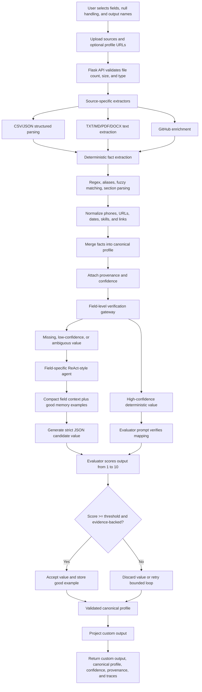
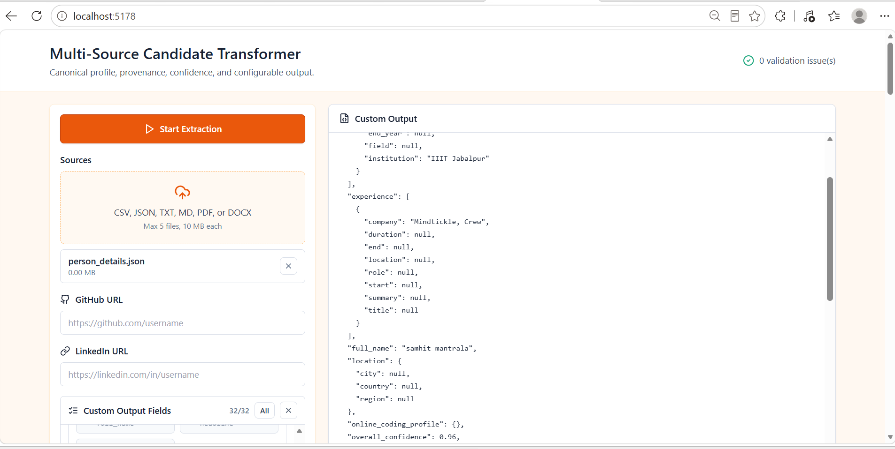
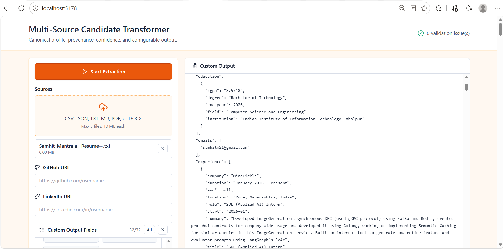
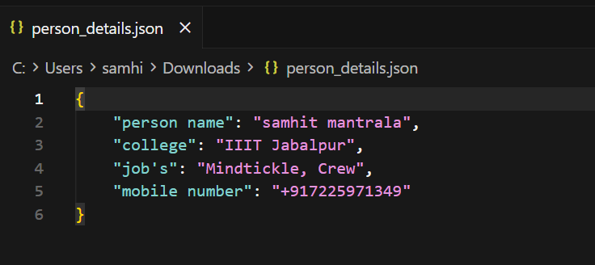
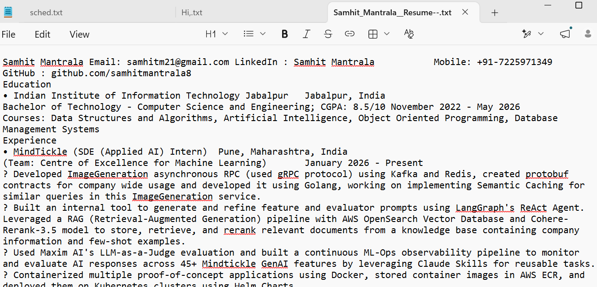
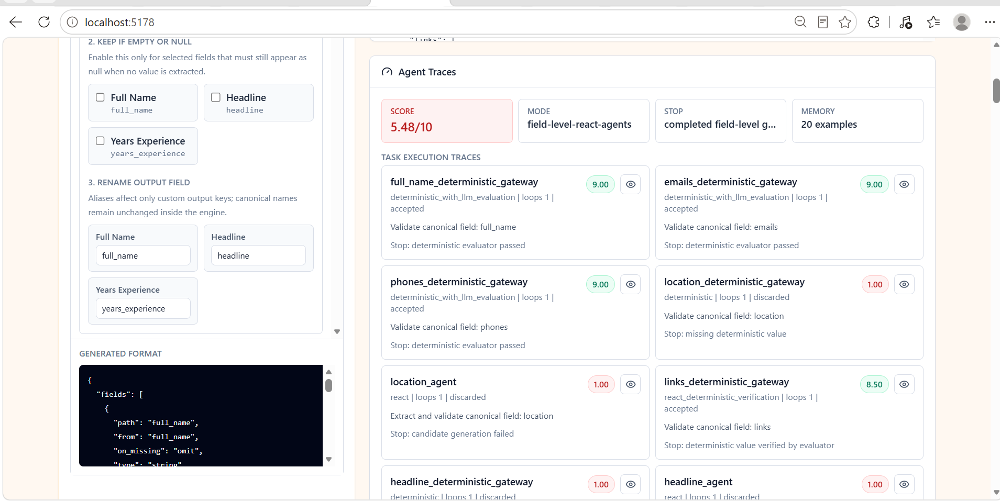
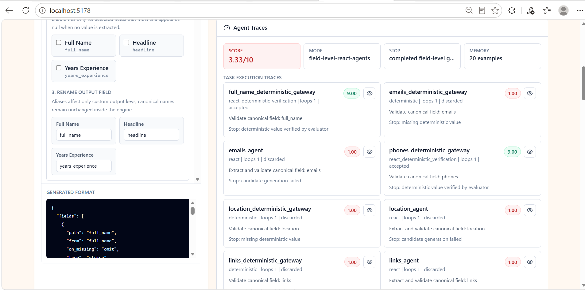

# Multi-Source Candidate Transformer

React, Tailwind CSS, Flask, and a hybrid deterministic plus Gemini evaluation pipeline for transforming messy candidate data into a clean canonical recruiting profile and a recruiter-configurable custom output schema.

## Submission Links

- [Demo video](https://drive.google.com/file/d/1DRub1W5JejM3rd1olBlqDQZeUExM6ez_/view?usp=drive_link) - also uploaded in the Google Form.
- [One-pager document](https://drive.google.com/file/d/1dCMJMVouwzVmy4h9k_txlQtdCw9qoAL9/view?usp=sharing) - also uploaded in the Google Form.

## What This Project Does

This application takes candidate information from multiple messy sources and converts it into a stable canonical profile. It also lets a recruiter choose exactly which fields should appear in a custom output structure, whether empty fields should be kept, and what output keys should be renamed to.

Supported inputs:

- CSV
- JSON or ATS-style JSON blobs
- TXT and MD notes
- PDF resumes
- DOCX resumes
- GitHub profile URLs
- LinkedIn profile URLs as normalized links

Upload limits:

- Maximum 5 files per extraction
- Maximum 10 MB per file

The frontend exposes one primary action: `Start Extraction`. After upload, the backend extracts, normalizes, validates, scores, and returns:

- A recruiter-configurable custom output
- A full canonical candidate profile
- Provenance and confidence metadata
- Agent traces with evaluator scores and intermediate steps

`extraction_errors` are intentionally not shown inside the canonical profile or custom output. Backend logs still retain processing visibility for debugging.

## Core Features

- **Canonical candidate schema:** consistent fields for identity, contact, links, education, experience, projects, skills, achievements, certifications, publications, online coding profile, GitHub repositories, languages, extracurriculars, other sections, provenance, confidence, and candidate ID.
- **Custom output builder:** select fields, keep selected empty fields as `null`, or omit missing values.
- **Field renaming:** rename fields only in the projected custom output while preserving canonical names internally.
- **Multi-format extraction:** file-type-specific extractors for structured and unstructured candidate data.
- **Deterministic extraction first:** regex, known aliases, section parsing, fuzzy matching, source-specific parsing, and normalization run before any LLM step.
- **Gemini-assisted ambiguity handling:** ambiguous field names, headings, and values can be evaluated with Gemini when deterministic confidence is not enough.
- **Per-field ReAct-style agents:** the larger extraction problem is decomposed into field-level tasks such as full name, email, phone, education, experience, skills, links, and projects.
- **Evaluator gate:** every field-level candidate value can be scored by an evaluator prompt. Values below the threshold are discarded instead of being blindly accepted.
- **SQLite memory:** high-scoring good examples are stored compactly and reused as context for later field-specific agent runs.
- **Traceable reasoning:** the UI shows task mode, loop count, score, stopping reason, system prompt, evaluator prompt, intermediate steps, and final accepted or discarded status.
- **GitHub enrichment:** public GitHub profile and repository metadata can be used as an additional source when a GitHub URL is provided or discovered.

## Hybrid Pipeline

The project is hybrid because deterministic extraction owns the first pass, while Gemini is used only for ambiguous, missing, or verification-sensitive fields.



## Canonical Profile

The canonical profile is the internal stable schema used for every candidate. Even if an uploaded source uses a different field name, such as `person_name`, `candidate name`, `mobile number`, `telephone`, `college`, `jobs`, or `tech_stack`, the backend attempts to map it to the closest canonical field.

Main canonical fields include:

- `full_name`
- `emails`
- `phones`
- `location`
- `links`
- `headline`
- `years_experience`
- `skills`
- `experience`
- `education`
- `projects`
- `achievements`
- `certifications`
- `publications`
- `online_coding_profile`
- `github_repositories`
- `languages`
- `extracurriculars`
- `other_sections`
- `others`
- `profile_summary`
- `resume_sections`
- `semantic_mappings`
- `provenance`
- `overall_confidence`
- `candidate_id`

`candidate_id` is kept at the bottom of the canonical and custom structures when selected.

## Agent And Evaluation Logic

The backend does not use one large prompt for everything. The task is decomposed into smaller field-level tasks. Each task has a purpose, a system prompt, an evaluator prompt, and a stopping rule.

For example:

- The phone agent focuses only on phone-number extraction and validation.
- The education agent focuses only on institution, degree, field, CGPA, and graduation year.
- The experience agent focuses only on company, role, location, duration, dates, and summary.
- The skills agent focuses on canonical skill names and avoids unsupported additions.

When a field is missing, ambiguous, or below confidence expectations, the ReAct-style loop can:

1. Build compact context from the uploaded source.
2. Add only relevant nearby evidence instead of sending the entire document.
3. Load up to the best stored examples for that field from SQLite memory.
4. Ask Gemini for strict JSON output.
5. Evaluate that output with a field-specific evaluator prompt.
6. Accept the value only if the evaluator score passes the threshold.
7. Store only good examples for future runs.
8. Stop when the value is accepted, the loop stops improving, or the maximum loop count is reached.

This design keeps the system practical: deterministic rules handle easy cases quickly, while Gemini is reserved for ambiguity, normalization, semantic mapping, and verification.

## Screenshots From Testing

### Custom Output From JSON Source



### Resume Text Extraction



### Sample JSON Input With Non-Canonical Field Names



### Sample Resume Input



### Agent Trace Scores



### Agent Trace Details



## Tech Stack

Frontend:

- React
- Tailwind CSS
- Vite
- Lucide React icons

Backend:

- Python
- Flask
- SQLite
- Gemini API
- PyPDF and PDF text extraction helpers
- DOCX extraction support
- GitHub public API enrichment

## Environment Setup

Create a local `.env` from `.env.example`.

```env
GEMINI_KEYS=your_gemini_api_key
GEMINI_MODEL=gemini-2.5-flash
GEMINI_AGENT_MODEL=gemini-2.5-flash
GEMINI_SUMMARY_MODEL=gemini-2.5-flash
USE_GEMINI_HYBRID=true
USE_AGENTIC_LLMOPS=true
AGENT_SCORE_THRESHOLD=8.5
AGENT_MAX_LOOPS=3
```

Only one Gemini key is needed for the documented setup.

## Run Locally

Backend:

```bash
python -m venv .venv
.venv\Scripts\activate
pip install -r requirements.txt
copy .env.example .env
python -m backend.app
```

Frontend:

```bash
cd frontend
npm install
npm run dev -- --host 127.0.0.1 --port 5178
```

Open:

```text
http://127.0.0.1:5178
```

The frontend proxies API requests to the Flask backend on port `5055`.

## API Endpoint

```text
POST /api/transform
```

Multipart fields:

- `files`: up to 5 candidate source files
- `github_url`: optional GitHub profile URL
- `linkedin_url`: optional LinkedIn profile URL
- `config`: optional custom projection JSON generated by the UI
- `default_region`: phone parsing region, sent by the frontend

## Verification

Useful local checks:

```bash
.venv\Scripts\python.exe -m pytest -q
cd frontend
npm run build
```

The latest local verification included focused backend tests and a frontend production build.

## Notes

- `.env`, `.venv`, runtime SQLite files, build outputs, and local demo drafts are ignored by git.
- The application returns conservative `null` or omitted fields when it cannot verify a value confidently.
- LinkedIn URLs are normalized and stored when supplied, but the project avoids unreliable LinkedIn scraping.
- The backend terminal logs each major processing step so extraction behavior can be inspected during demos.
