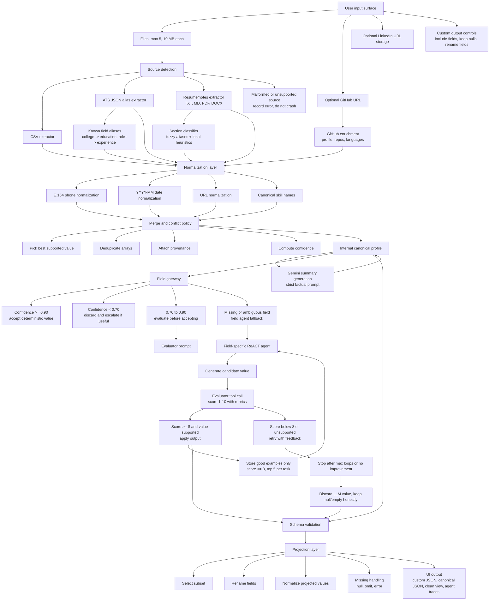

# Demo Script: Multi-Source Candidate Data Transformer

Use this as a 9-minute recording script. The goal is to show the app working, then explain why the pipeline is trustworthy: deterministic first, LLM only as controlled fallback, every field traceable, and custom output generated from the same canonical record.

## Normal Flow Diagram

```mermaid
flowchart LR
    A["Upload sources<br/>CSV, JSON, TXT, MD, PDF, DOCX"] --> B["Extract facts"]
    B --> C["Normalize<br/>phones, dates, links, skills"]
    C --> D["Merge and dedupe<br/>source weights + confidence"]
    D --> E["Canonical profile"]
    E --> F["Agentic fallback<br/>only for missing or low-confidence fields"]
    F --> G["Validate"]
    G --> H["Project custom output<br/>select, rename, keep/omit nulls"]
    H --> I["Display JSON + clean profile + traces"]
```

## Detailed Pipeline Diagram

## 9-Minute Speaking Script

### 0:00-0:45 Opening

"This project is a multi-source candidate data transformer. The assignment asks for one clean canonical profile from messy candidate sources. The important part is not just extracting data, but making sure wrong confident values do not silently pollute downstream hiring systems. So the design is deterministic-first, provenance-heavy, and conservative when evidence is weak."

"The app supports structured inputs like CSV and ATS-style JSON, and unstructured inputs like recruiter notes, PDF resumes, DOCX resumes, and GitHub profile URLs. It also has a configurable projection layer so the same internal canonical record can produce different recruiter-specific output schemas without code changes."

### 0:45-1:45 UI Walkthrough

"On the left side, the recruiter can upload up to five files, each capped at 10 MB. The supported formats are CSV, JSON, TXT, MD, PDF, and DOCX. The upload area now shows the supported formats directly."

"There are optional fields for GitHub and LinkedIn URLs. GitHub is enriched using public API data, including repositories and languages. LinkedIn is handled conservatively as a supplied URL, because scraping LinkedIn reliably usually requires authentication and can be brittle."

"The default phone region is used only when a phone number is missing a country code. For example, an Indian number can be normalized to E.164 if the region is set to IN."

"Below that is the custom output section. This is the runtime config from the assignment, but exposed through UI controls. First, I can select which canonical fields to include. Second, I can choose which empty fields should still appear as null. Third, I can rename any field in the projected output. The internal field name stays canonical; only the output projection changes."

"The candidate ID is included as metadata at the bottom, because it is useful for downstream systems but should not visually dominate the candidate profile."

### 1:45-3:00 Deterministic Core

"The core pipeline starts with source detection. CSV goes to a CSV extractor, ATS JSON goes to an alias-aware JSON extractor, and TXT, MD, PDF, and DOCX go through the resume or notes extractor."

"For DOCX, the backend extracts paragraphs and table cells, then feeds the result into the same resume parser used for text-like sources. This keeps the extraction path consistent instead of building separate logic for each resume format."

"The deterministic layer extracts facts, not final fields. Each fact has a field path, value, source, method, confidence, and evidence. For example, an email from JSON may become an `emails` fact with method `ats-json:email-alias`, while a GitHub profile URL may become a `links.github` fact."

"Then we normalize. Phones are normalized to E.164, dates to YYYY-MM where possible, URLs are normalized, and skills are canonicalized so variants like ReactJS and React can merge cleanly."

"After normalization comes merge and conflict resolution. The merger groups facts by field, deduplicates arrays, and picks the strongest fact when values conflict. It uses source confidence and small source weights. Structured sources like ATS JSON and CSV get a little more weight than free text, because they are usually less ambiguous. Every accepted value keeps provenance so the user can see where it came from and how it was produced."

### 3:00-4:00 Canonical Schema

"The internal canonical profile is fixed. It includes identity, contact, location, links, headline, years of experience, skills, experience, education, projects, achievements, online coding profile, repositories, languages, extracurriculars, other sections, provenance, confidence, errors, and candidate ID."

"The candidate ID is deterministic. It is generated from stable anchors like email, phone, name, GitHub, or LinkedIn. If the source is sparse, it still generates a stable hash-style ID without inventing personal data."

"The important separation is that canonical profile and custom output are not the same thing. The canonical profile is the internal source of truth. The custom output is a projection."

### 4:00-5:15 Projection and Validation

"After the canonical profile is built, the validator checks basic schema expectations. Phone numbers must be E.164, dates must match YYYY-MM where present, list fields must be lists, and confidence must be numeric."

"Then the projection layer applies the runtime config. This is where selected fields are included, paths can be remapped, fields can be renamed, output values can be normalized, and missing values can be null, omitted, or treated as errors."

"This is important for the assignment because it proves the engine is not hardcoded to one output shape. A recruiter or downstream system can ask for `primary_email` from `emails[0]`, or rename `links.github` to `github_url`, without changing the extraction logic."

### 5:15-7:15 Agentic Fallback and Evaluation

"The agentic layer is intentionally not the primary extractor. It is a fallback and evaluator for ambiguity. The deterministic pipeline is the source of truth. The LLM is used only when a field is missing, low-confidence, or ambiguous."

"The decomposition is per canonical field. There is a full name agent, phone agent, education agent, experience agent, skills agent, projects agent, and so on. Each one has a field-specific system prompt. That matters because phone extraction, education extraction, and project extraction have different rules. For example, the phone agent must return E.164 numbers only, while the education agent maps college, school, university, degree, branch, and CGPA into the education structure."

"The ReACT-style loop is bounded. For each field agent, the system gives it field-specific input, the current canonical snapshot, and any previous evaluator feedback. The agent proposes a value in strict JSON. Then an evaluator tool call scores the output from 1 to 10 using rubrics: correctness, format, evidence, and specificity."

"If the score is at least 8 and the output is supported by evidence, we apply it. If the value is empty, hallucinated, schema-unsafe, or unsupported, it is discarded even if the evaluator response looks confident. The loop can retry with feedback, but it stops after a max loop count or when the score stops improving. This prevents infinite loops and keeps runtime bounded."

"Good examples are stored only when they score 8 or above. The memory keeps the top examples per task, so future field agents can see compact successful examples without storing entire resumes unnecessarily. Bad examples are not used as prompt context; failed outputs are useful as traces, but not as training examples."

"In the UI, the Agent Traces section shows which tasks were deterministic, which escalated to a ReACT agent, the number of loops, evaluator scores, stopping reason, prompts, intermediate candidate outputs, and final accepted or discarded status. This is for explainability and debugging."

### 7:15-8:15 Robustness and Edge Cases

"There are a few deliberate robustness choices. If a source is malformed, the run records an extraction error instead of crashing. If a field is missing, it stays null or empty rather than being invented. If JSON uses odd field names like `college`, `branch`, or `role`, the alias extractor maps them to canonical education or experience when obvious. If it cannot confidently map a value, it stays in `others`."

"For multiple files, the pipeline appends facts from all sources, deduplicates repeated values, and resolves conflicts with confidence and provenance. This is important because the same candidate may appear in CSV, JSON, resume, and GitHub with overlapping or conflicting information."

"For scale, the deterministic path is the scalable path. The LLM layer is controlled and should be used only for ambiguous fields. In a production setting, the agentic fallback can be disabled, rate-limited, or run only on records that fail deterministic quality checks."

### 8:15-9:00 Closing

"To summarize, the design is extract facts, normalize, merge with confidence, validate, and project. The UI is intentionally thin but demonstrates the important capabilities: multi-source input, configurable output, clean canonical profile, provenance, confidence, and agent traces."

"The main design decision I am proud of is keeping the canonical record separate from the custom projection. That makes the system flexible without making extraction logic messy."

"The edge case I would highlight is honestly-empty behavior. If the system cannot prove a value, it leaves it null or in `others` instead of guessing. That directly matches the assignment’s warning that wrong-but-confident is worse than honestly-empty."

"Under more time, I would add OCR for scanned resumes and authenticated LinkedIn ingestion. But for the assignment scope, the current implementation covers structured and unstructured sources, normalization, merge, confidence, provenance, custom projection, validation, tests, and an explainable agentic fallback."
